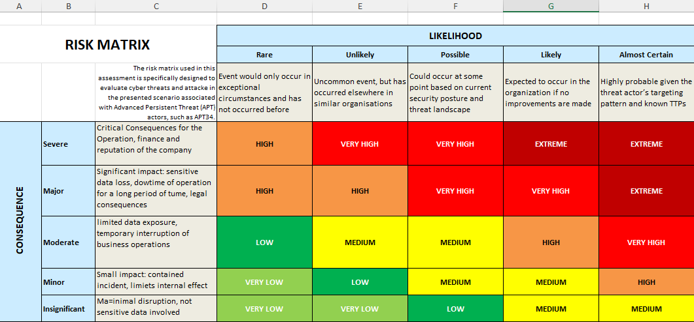

# 🔐 Cybersecurity Risk Assessments

Welcome to the **Risk Assessments** section of my Cybersecurity Portfolio.  
Here, I present hands-on risk evaluation exercises inspired by real-world cyber threats, applying structured methodologies and governance principles across critical sectors.

Each assessment includes:
- A completed risk assessment spreadsheet (.xls)
- A clear scenario description and defined scope
- A visual or embedded risk matrix
- Proposed control recommendations aligned with industry-recognized information security frameworks.

---

## 📁 Assessment Scenarios

###  1. Tech Company Client – APT34 Risk Assessment  
**Case Study:** [DATACOM | The Forage Simulation](https://www.theforage.com/simulations/datacom/cybersecurity-zm6d)

As part of a simulated consultancy engagement with **Datacom Job Simulation**, I completed a comprehensive risk assessment following a targeted attack by **APT34**, a state-sponsored Advanced Persistent Threat group. I assumed the role of a cybersecurity consultant tasked with identifying risk exposures and advising on mitigation strategies after the compromise of a major tech client's internal systems.
The attack led to the **exfiltration of sensitive customer data and intellectual property**, prompting an urgent review of the client’s internal security posture.

While the sample answer presents risks at a general asset level, I chose to tailor my assessment specifically to the tactics, techniques, and procedures (TTPs) used by the APT34 threat group, based on the nature of the cyber incident experienced by the client.

---

####  1.1. Scenario

  In this simulation, I analyzed a breach attributed to APT34 and performed a structured risk assessment focused on:
  
  - Identifying **vulnerable assets** within the internal network (specifically: a **SQL Database** and a **Cloud Storage Service**)  
  - Mapping **entry points** exploited via spear-phishing and lateral movement  
  - Evaluating **gaps in existing controls** across technical and organizational layers
  
  While the client had basic physical security (e.g. perimeter fence, padlocked entry), they lacked a formal internal cybersecurity risk management strategy.

#### 1.2. Scope

  This assessment focused on the following **critical assets**:
  - **SQL Database**: Housing sensitive operational and customer data  
  - **Cloud Storage Service**: Used for business document storage and backups
  
  Both assets were evaluated in terms of exposure, likelihood of compromise, and potential impact, considering attacker TTPs mapped to the **MITRE ATT&CK framework**.

#### 1.3. Risk Matrix

A Likelihood × Consequence model was used to score each scenario both **before** and **after** the implementation of control recommendations.

>   

#### 1.4 Frameworks & Tools Used

- **NIST SP 800-30** – [Guide for Conducting
Risk Assessments](https://nvlpubs.nist.gov/nistpubs/Legacy/SP/nistspecialpublication800-30r1.pdf)
- **CISA SAFECOM** – [Guide to Getting Started with a Cybersecurity Risk Assessment](https://www.cisa.gov/sites/default/files/video/22_1201_safecom_guide_to_cybersecurity_risk_assessment_508-r1.pdf)
- **Essential Eight** – [Assesment Process Guide](https://www.cyber.gov.au/resources-business-and-government/essential-cybersecurity/essential-eight/essential-eight-assessment-process-guide)  
- **MITRE ATT&CK** – [TTP and mitigations](https://attack.mitre.org/)

#### 1.5. Deliverables

- 📄 [Risk Assessment Spreadsheet (.xlsx)](./Docs/Risk%20Assessment%20DataCom-Case%20Study.xlsx)
  
  Includes:
  - Defined threat scenarios
  - Likelihood and impact ratings
  - Existing vs. additional control evaluations
  - Residual risk levels

#### 1.6. Highlights

- Applied threat intelligence on APT34 to real-world enterprise context
- Mapped attacker TTPs using MITRE ATT&CK  
- Designed a structured and auditable risk matrix for two critical IT infraestructure assets
- Aligned control recommendations with industry frameworks  
- Delivered a traceable and actionable assessment report
---

💬 **Feedback or questions?**
Feel free to connect with me on [LinkedIn](https://www.linkedin.com/in/ilce-andrea-aquino-de-hoge-73463593) or submit in this repo.

